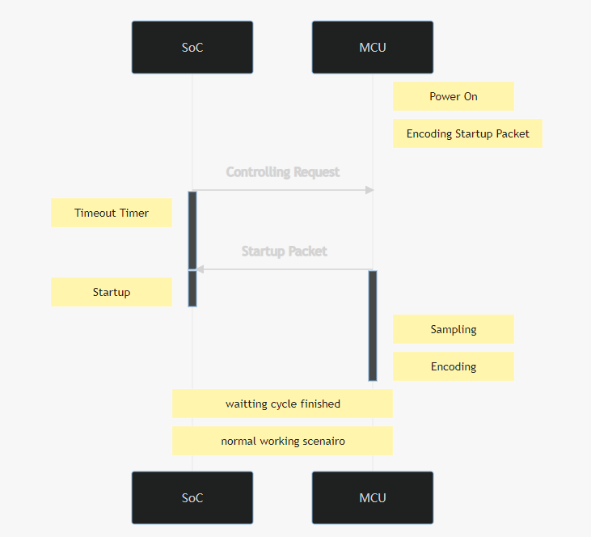

## For USART Only

## Control Request Packet
Offset | Name | Content | Width (Bytes)
-:|:-|:-:|-:
0 | Packet Header | 0x55 | 1
1 | Motor Power # 1 | xx | 1
2 | Motor Power # 2 | xx | 1
3 | Motor Power # 3 | xx | 1
4 | Motor Power # 4 | xx | 1
5 | Melody Index | xx | 1
6 | LED | xx | 1
7 | CRC for payload only | xx | 1
8 | Packet Ending | 0xAA | 1

## Sampling Data Packet

Offset | Name | Content | Width (Bytes)
-:|:-|:-:|-:
0 | Packet Header | 0x55 | 1
1 | Timestamp (Milliseconds) | xx | 4
5 | Time Offset (Micro Seconds) | xx | 4
9 | Motor Encoder #1 | xx | 2
11 | Motor Encoder #2 | xx | 2
13 | Motor Encoder #3 | xx | 2
15 | Motor Encoder #4 | xx | 2
17 | Fast ADC Value #1 ~ #14 | xx | 28
45 | Slow ADC Index | xx | 1
46 | Slow ADC Value | xx | 2
48 | UserInput | xx | 1
49 | CRC for payload only | xx  | 1
50 | Packet Ending | 0xAA | 1

# dalekFoot
## System Architecture

## MCU components connection diagram

## Neuro Software Architecture

## Protocol
### Working Scenario

### Startup Scenario

### Timeout Scenario

# stm32

## Interrupt NVIC

* Systick is the top piority timer

## Timer

* Systick is the top piority timer
* Systick should not block other event, It should be async and just make a notify

## TODO

o communication with SPI in slave mode
o communication with SPI and calculate the CPU usage

