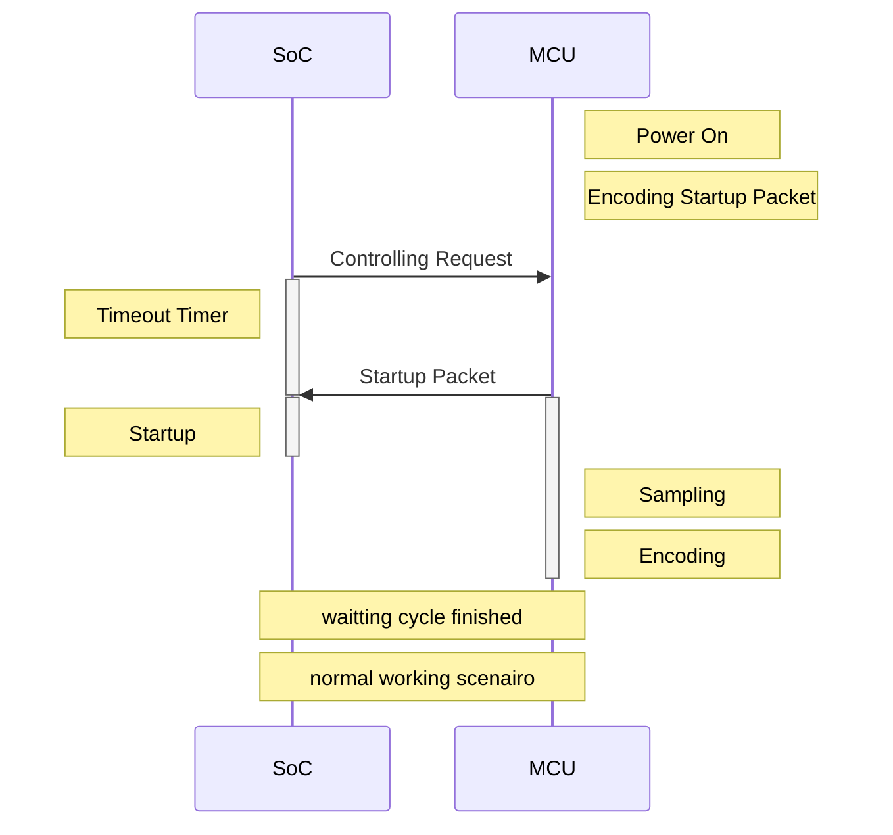

```mermaid
sequenceDiagram
	participant s as SoC
  participant m as MCU	
	Note right of m: Power On
	Note right of m: Encoding Startup Packet
	s ->> m: Controlling Request
	activate s
	Note left of s: Timeout Timer
	m ->> s: Startup Packet
	deactivate s
	activate m
	activate s
	Note left of s: Startup
	deactivate s
	Note right of m: Sampling
	Note right of m: Encoding
	deactivate m
	
	Note over s, m: waitting cycle finished
	Note over s, m: normal working scenairo
```
