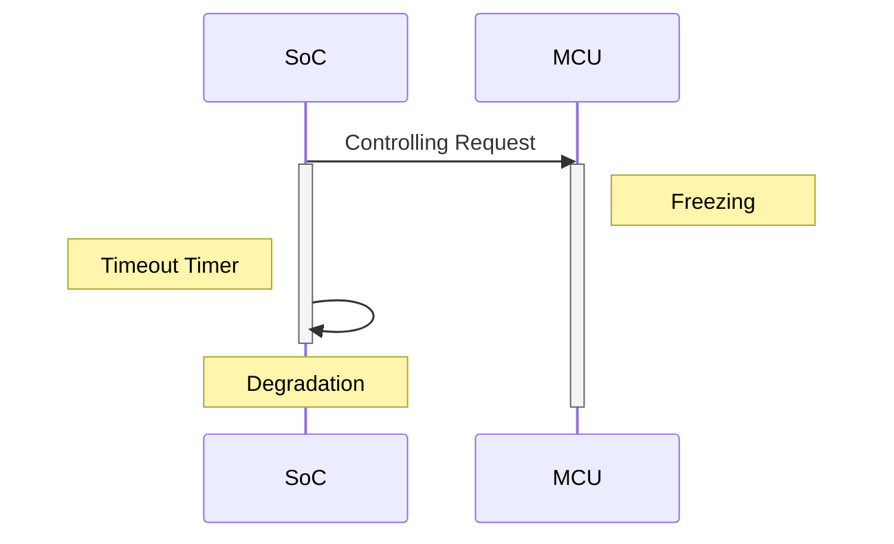

```mermaid
sequenceDiagram
	participant s as SoC
  participant m as MCU
	s ->> m: Controlling Request
	activate s
	activate m
	Note right of m: Freezing
	Note left of s: Timeout Timer
	s ->> s: 
	deactivate s
	Note over s: Degradation
	deactivate m
```
