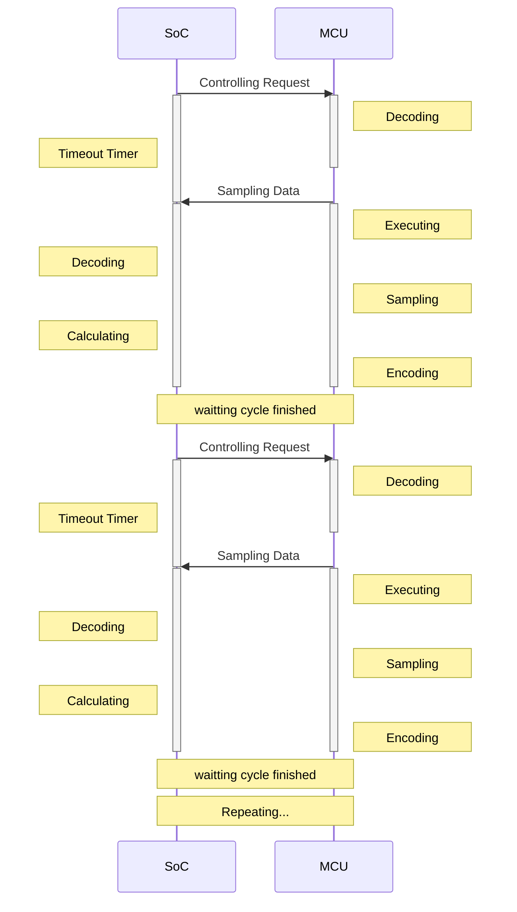

```mermaid
sequenceDiagram
	participant s as SoC
  participant m as MCU

	s ->> m: Controlling Request
	activate m
	activate s
	Note right of m: Decoding
	Note left of s: Timeout Timer
	deactivate m
	m ->> s: Sampling Data
	deactivate s
	activate m
	activate s
	Note right of m: Executing
	Note left of s: Decoding
	Note right of m: Sampling
	Note Left of s: Calculating
	Note right of m: Encoding
	deactivate s
	deactivate m
	Note over s, m: waitting cycle finished

	%% repeating...

	s ->> m: Controlling Request
	activate m
	activate s
	Note right of m: Decoding
	Note left of s: Timeout Timer
	deactivate m
	m ->> s: Sampling Data
	deactivate s
	activate m
	activate s
	Note right of m: Executing
	Note left of s: Decoding
	Note right of m: Sampling
	Note Left of s: Calculating
	Note right of m: Encoding
	deactivate s
	deactivate m
	Note over s, m: waitting cycle finished
	
	Note over s, m: Repeating...
```
